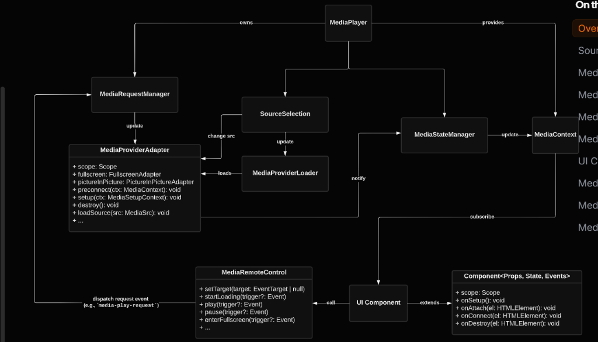
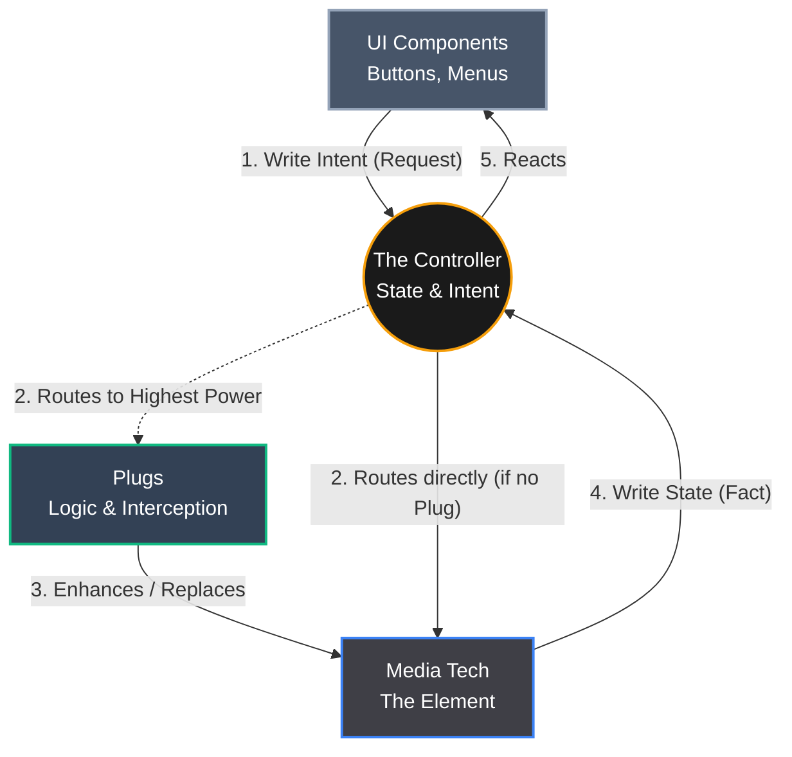

# State & Intent Architecture (S.I.A.) vs Traditional Players

Traditional architectures (like Vidstack or Video.js) rely on deeply nested adapter patterns and rigid inheritance trees. The UI is tightly coupled to a Context Provider, which is tightly coupled to an Adapter, which manages a Request Manager, which finally talks to the Media Element. Adding new features requires digging through layers of abstraction.

S.I.A. replaces this convoluted stack with a pure, reactive, circular flow. 

### The Old Way (Vidstack / Traditional)

*This is the labyrinth of managers, adapters, and context providers required just to pause a video in traditional architectures.*

### The S.I.A. Way (Pure Simplicity)
In S.I.A., the UI writes what it wants to happen (Intent). The Controller routes it. Plugs can optionally step in to enhance or entirely replace the Tech's execution. Finally, the Tech writes what actually happened (State), and the UI reacts.

### The Core Difference
In S.I.A, there are no rigid adapters, no context providers, and no direct method calls from the UI to the video. 
- You want to pause? The UI doesn't call `player.pause()`. It writes to the tree: `intent.paused = true`.
- Plugs listen to the Controller. A gesture plug or a voice-control plug doesn't need to hack into the UI—it just writes intents directly to the tree.
- If a specific Plug needs to enhance an action (like a custom Volume Plug taking over volume rendering instead of the native video tech), it intercepts the intent (Higher Power).
- The video pauses. The Tech writes to the tree: `state.paused = true`.
- The UI automatically updates.

The architecture is infinitely flat. You can rip out the Tech entirely and replace it, or rip out the UI and replace it, and the Plugs won't even notice.
